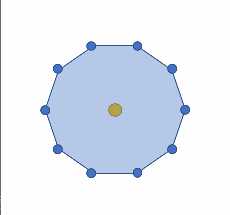
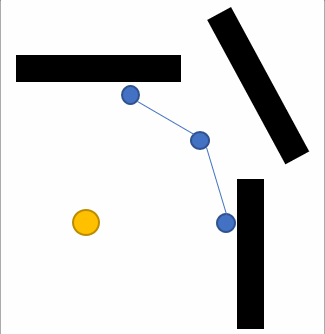
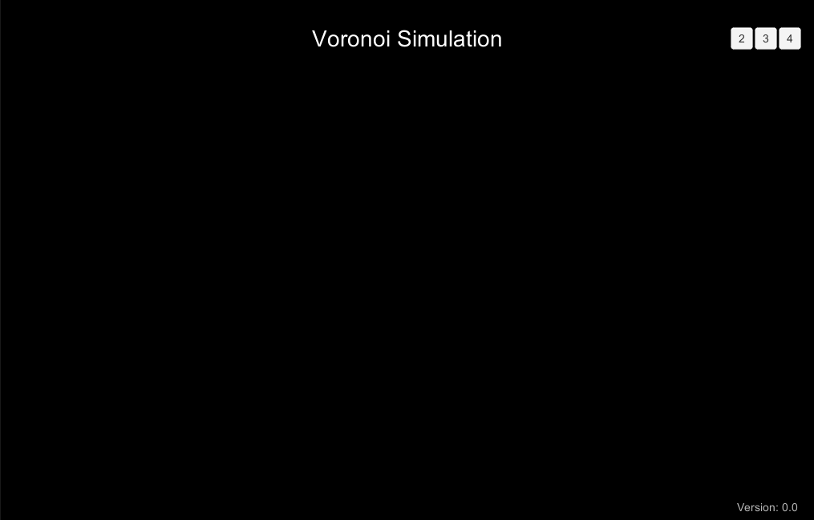

# Voronoi-Simulation-Using-Cone-Projection
This project simulates the generation of voronoi diagrams. It uses an approach that I have created, similar to the cone projection approach for approximately computing the regions.  

` IMPORTANT: The code is not optimized for handling large number of regions. It is only meant for demonstration purposes.`

The developed solution follows an emergent-behavior approach for computing the regions. It consists of three simple steps.

1) **Initialization**: During this phase, each seed gets an initial region. The region is created by defined number of segments, forming a circular region. The higher the number of segments used, the smoother the circle is, and the more accurate the simulation is.
2) **Expansion**: 
3) **Termination**: 

| Initialization | Expansion | Termination |
| :-----: | :-------: | :-------: |
|  |  |  |

# Demo



We created a WebGL application that demonstrates how vornoi regions get created.
A complete demo can be found on [https://omaddam.github.io/Voronoi-Simulation-Using-Cone-Projection/](https://omaddam.github.io/Voronoi-Simulation-Using-Cone-Projection/).

# Getting Started

These instructions will get you a copy of the project on your local machine for development and testing purposes.

### Prerequisites

The things you need to install before you proceed with development:

1) [Unity3d (2020.2.0f1)](https://unity3d.com/get-unity/download/archive) [required].

### Installing

A step by step guide to get you started with development.

#### Download, clone, and setup the repository

```git
git clone https://github.com/omaddam/Voronoi-Simulation-Using-Cone-Projection.git
```

#### Initialize git flow

```git
git flow init
```

# Standards

### General Standards

* Line ending: CRLF
* Case styles: Camel, Pascal, and Snake case
  * Arguments, paramters, and local variables: camel case (e.g. kanbanBoard)
  * Global variables: pascal case (e.g. SeedItems)
  * Constants and static variables: snake case (ALL CAPS) (e.g. DEFAULT_CATEGORY_NAME)
* Methods naming convention:
  * Pascal case (e.g. GenerateSample)
  * Verbs

### Commenting Standards

* `///` Summaries: Full-usage of English grammar and punctuation. (e.g. Add periods to the end of your summaries, as if you were writing a phrase or sentence.)
*  `//` In-line comments: quick, point-form. Grammar and punctuation not needed

### Assets / App

* Contains all scripts and resources used in the demo.
* Scripts are created under Assets/App/Scripts folder.

### Assets / Others

* All components should be included under Assets/\<Name> folder. (e.g. Assets/KanbanBoard)
* Each component should be isolated and under **NO CIRCUMSTANCES** referencing or using another component's scripts.
* Components are **NOT** allowed to reference or call application/demo scripts.